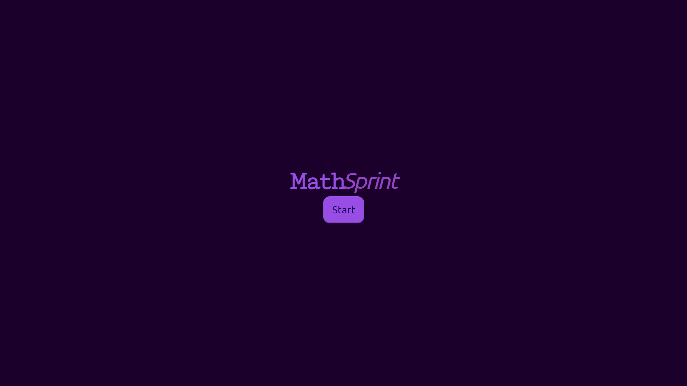
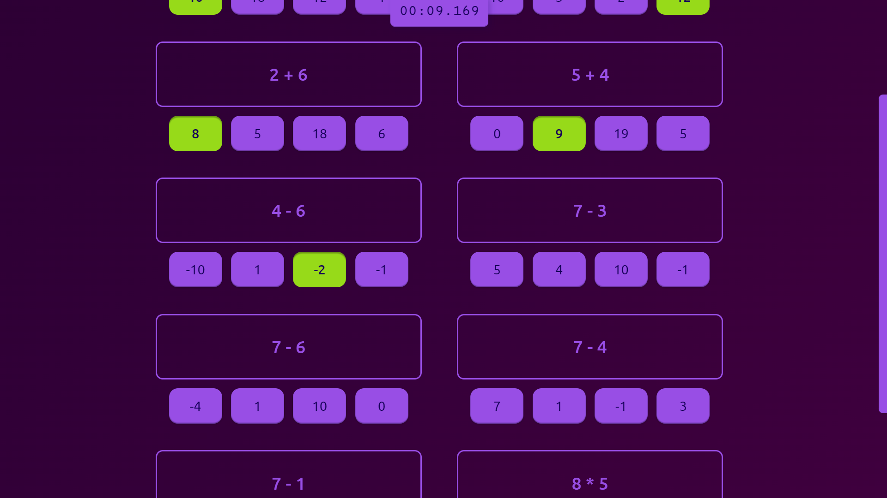
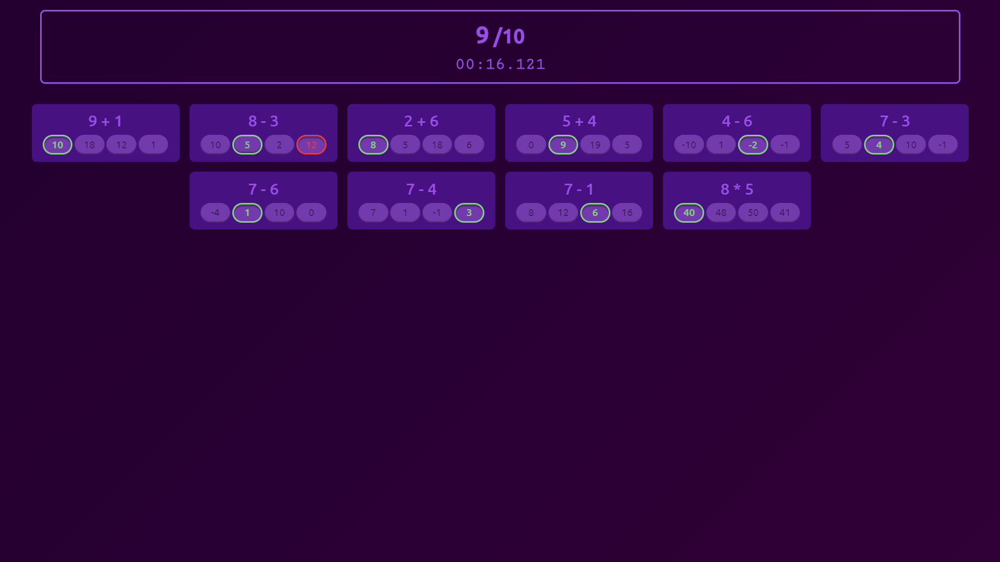

# MathSprint

*MathSprint* is a simple timed math quiz built with HTML, JS, and CSS. It can be used as a math practice or just as a casually competitive game.

> :warning: This README contains mathematical expressions that may not be visible in dark mode. Switch to light mode in your [user settings](https://github.com/settings/appearance) to see them.

## Game

The game is simple, you press start and try to answer 10 simple math questions as quickly as possible.

The questions are randomly generated each time, and they cover addition, subtraction, and multplication. You do not have to answer the questions in sequence.

As you do the quiz, a timer keeps track of the time you have taken.

After answering all the questions, submit your answers and your results will be shown.

## Questions

All questions are simple binary arithmetic expressions.

### Operators

Only the addition, subtraction and multiplication operators are used in the questions. This greatly reduces the difficulty of the game and allows players of all ages.

### Operands

Currently, only integers from 0 to 10 are used as operands. This also serves to reduce the difficulty of the game.

## Devices

*MathSprint* is built to work on all devices with different screen sizes. 

## Future Plans

These are the features I plan to add to *MathSprint* in the future.

### Higher difficulty

Add a settings screen on the cover page to let players adjust their preferred difficulty. The difficulty can be controlled using several aspects.

#### Operators

Operators of higher complexity can be used. This includes, in increasing difficulty:

1. Division <!-- $a\div b$ --> 
2. Exponent <!-- $a^b$ --> 
3. Roots <!-- $\sqrt[a]{b}$ --> 

#### Operands

The range of operands can be increased beyond the current ranged used.

#### Expression length

Longer mathematical expressions can be used. The current implementation only uses a single binary expression. Longer expressions requires more calculations and the knowledge of the mathematical order of operations:

1. <!-- $3 + 5 * 10$ --> 
2. <!-- $6 * 10 - 3$ --> 
3. <!-- $4 \times 5 \div 2$ --> 

### Better incorrect answers generation

The current implementation generates incorrect answers by random selecting numbers from the range <!-- $\{y : x-10\leq y \leq x + 10\} - \{x\}$ -->  for each correct answer <!-- $x$ --> .

A better method of generating wrong answers is to slightly modify the operands of the questions and setting the answer to the modified expression as an incorrect option.

For example, given an expression

<!-- $$9 + 6$$ --> 

The wrong answers can be generated as

1. <!-- $8 + 6 = 14$ --> 
2. <!-- $8 + 5 = 13$ --> 
3. <!-- $9 + 7 = 16$ --> 

This better simulates calculation errors in real life.